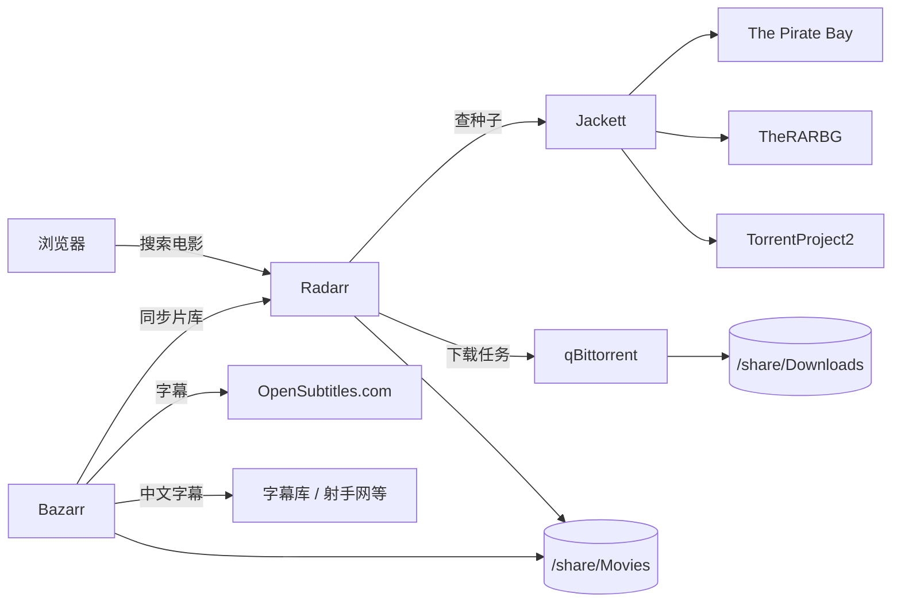

# Raspberry Pi Docker Homelab

树莓派上的 Docker Homelab 配置，主要用来自动化电影下载、字幕管理和家庭影音播放。

## 服务一览

| 服务 | 端口 | 作用 |
|------|------|------|
| [Jellyfin](https://jellyfin.org/) | 8096 | 媒体服务器，播放电影和电视剧 |
| [Radarr](https://radarr.video/) | 7878 | 电影管理 + 自动搜索下载 |
| [Jackett](https://github.com/Jackett/Jackett) | 9117 | 索引器聚合，把公开 BT 站封装成 Torznab API |
| [qBittorrent](https://www.qbittorrent.org/) | 8085 | BT 下载客户端 |
| [Bazarr](https://www.bazarr.media/) | 6767 | 自动下载电影/剧集字幕 |
| [AdGuard Home](https://adguard.com/adguard-home.html) | 80 / 3000 | 局域网 DNS 过滤 |
| [Portainer](https://www.portainer.io/) | 9443 | Docker 可视化管理 |
| [V2Ray](https://www.v2fly.org/) | 10808 / 10809 | 代理，供 Jackett/Bazarr/Radarr 访问外网 |

## 快速开始

```bash
cd /home/pi/docker
docker compose up -d
```

## 核心工作流



1. 在 Radarr 搜索并添加想看的电影。
2. Radarr 通过 Jackett 查询 TPB / TheRARBG / TorrentProject2。
3. 选择合适种子后，Radarr 把任务推给 qBittorrent 下载。
4. 下载完成后 Radarr 把电影硬链接/整理到 `/share/Movies`。
5. Bazarr 同步片库，自动下载英文和中文 SRT，后处理合并成 `*.zh+en.srt`。

## 文档

- [`README-movie-dl.md`](./README-movie-dl.md)：Radarr + Jackett + qBittorrent 自动电影下载配置
- [`README-subtitles.md`](./README-subtitles.md)：Bazarr 中英双语字幕配置
- [`Radarr-Manual-Guide.md`](./Radarr-Manual-Guide.md)：Radarr 手动搜索和下载流程

## 注意事项

- 所有服务默认只在局域网暴露端口，公网访问请自行加反向代理 + HTTPS。
- V2Ray 代理配置在 `v2ray/config.json`，请替换为你自己的节点信息。
- 部分服务的 API Key / 密码在 `compose.yml` 和相关配置里以明文存放，仅供家庭实验环境使用。

## 硬件环境

- Raspberry Pi（ARM64，8 GB RAM）
- OS：Linux 6.12+
- Docker 29.x / Docker Compose v2+
- 外接硬盘通过 Samba 挂载到 `/share`
